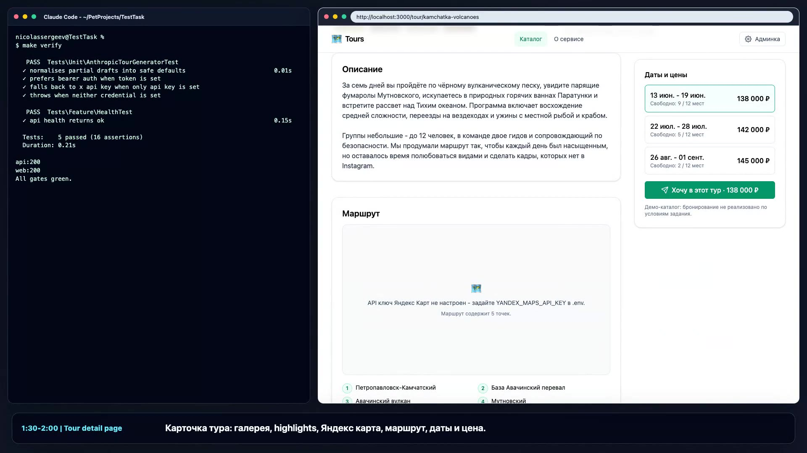

# Tours · авторский каталог с семантическим поиском

Полноценное веб-приложение по тестовому заданию Full-stack AI Engineer:
каталог авторских туров с фильтрами, семантическим поиском по эмбеддингам,
картой маршрута и админкой с автогенерацией черновика тура через LLM.

## Demo video

[](video/demo-tour-catalog.mp4)

Видео: [video/demo-tour-catalog.mp4](video/demo-tour-catalog.mp4)

```
        ┌──────────────┐    ┌──────────────────┐
        │  Vue + Vike  │◀──▶│  Laravel 11 API  │◀──── Filament admin (/admin)
        │   (SSR :3000)│    │      :8000       │
        └─────┬────────┘    └──────┬───────┬───┘
              │                    │       │
        Yandex Maps JS        ┌────▼──┐  ┌─▼─────────────┐
                              │ pg-16 │  │ Embeddings    │
                              │+vector│  │ FastAPI :8001 │
                              └───────┘  │ MiniLM-L12 v2 │
                                         └───────────────┘
```

## Quickstart

```bash
git clone <repo> tours && cd tours
cp .env.example .env
# Optional: paste your YANDEX_MAPS_API_KEY into .env.
# LLM auth - pick ONE of:
#   ANTHROPIC_API_KEY=sk-ant-...                  # direct Anthropic
#   ANTHROPIC_AUTH_TOKEN=sk-...                   # any Anthropic-compatible proxy (e.g. gngn.my)
#   ANTHROPIC_BASE_URL=https://api.gngn.my/v1     # set when using a proxy
docker compose up -d --build      # ~2–3 min on first run (HF weights download)
make verify                       # smoke gate (tests + typecheck + http probes)
```

Открыть:

- **Каталог:** http://localhost:3000/
- **Админка:** http://localhost:8000/admin · `admin@tours.local` / `password`
- **API:** http://localhost:8000/api/tours · http://localhost:8000/api/tours?q=зимний+поход
- **Embeddings health:** http://localhost:8001/health

## Стек

| Слой | Технологии |
|------|------------|
| Бэкенд | PHP 8.3 · Laravel 11 · Filament 3 · PostgreSQL 16 + **pgvector** · Eloquent |
| Фронт | Vue 3 · **Vike** (SSR) · Vite · **Tailwind 4** (через `@tailwindcss/vite`) · **PrimeVue 4** с кастомным пресетом |
| Эмбеддинги | FastAPI · `sentence-transformers/paraphrase-multilingual-MiniLM-L12-v2` (384-dim) |
| LLM | Anthropic Claude (haiku) - генерация черновика тура в админке. Поддерживает как прямой API (`x-api-key`), так и совместимые прокси с Bearer-токеном (gngn.my и другие) |
| Карты | Яндекс Карты JS API |
| Инфра | Docker Compose · монорепозиторий |

## Структура

```
backend/        Laravel API + Filament + сервисы (TourSearch, TourIndexer, AnthropicTourGenerator)
frontend/       Vike + Vue + Tailwind 4 + PrimeVue (custom theme)
embeddings/     FastAPI-сайдкар, считает эмбеддинги для поиска и индексации
docker/         init.sql (включает pgvector, pg_trgm, unaccent)
docs/           Архитектура, ADR, AI-workflow заметки
.claude/        Sub-agents, slash-команды, settings, skills для Claude Code
CLAUDE.md       Главный bootstrap для агента (см. ниже)
AGENTS.md       Tool-agnostic версия для opencode / codex
Makefile        Шорткаты для разработки: up / verify / reseed / reindex …
```

## Возможности

- **Каталог** с гибкими фильтрами: категории, длительность, цена, даты, сложность; SSR-страница + кликабельные URL с фильтрами в query string.
- **Семантический поиск** по pgvector + HNSW-индекс. При недоступности эмбеддингов автоматически откатывается на ILIKE.
- **Карточка тура**: галерея с миниатюрами, описание, выбор даты + цена, маршрут на Яндекс Карте с порядковыми метками и подписями точек.
- **Админка (Filament):**
  - CRUD тур + категорий + дат + фотоальбома (reorderable repeater);
  - точки маршрута редактируются как координаты + подпись;
  - кнопка **«Сгенерировать через LLM»** заполняет все поля черновика тура одной строкой запроса (Anthropic Messages API, prefill `{`);
  - action «Переиндексировать» - пересчёт эмбеддинга на месте.
- **Авто-индексация**: при сохранении тура `TourIndexer` пересчитывает эмбеддинг; есть `php artisan tours:reindex` для bulk.

## Тестирование

```bash
make test         # PHPUnit (Feature + Unit)
make typecheck    # vue-tsc
make verify       # всё сразу + HTTP-пробы
```

Юнит-тест `AnthropicTourGeneratorTest` проверяет, что нормализация
LLM-ответа корректно гасит «битые» драфты.

## AI окружение (для рецензента)

50 % оценки - за AI-workflow. Что сделано:

1. **`CLAUDE.md`** - главный бутстрап-файл агента: правила, репозитарная
   карта, чек-лист верификации перед сдачей.
2. **`AGENTS.md`** - tool-agnostic вариант (читают opencode и codex).
3. **`.claude/agents/`** - 3 специализированных sub-agent:
   `backend-expert`, `frontend-expert`, `ai-expert`. У каждого свой
   набор инструментов и зона ответственности.
4. **`.claude/commands/`** - slash-команды для типовых workflow:
   - `/dev` - поднять стек и дождаться готовности;
   - `/verify` - прогнать smoke-гейты (тесты + typecheck + HTTP-пробы);
   - `/feature` - план-и-исполнение фичи через делегирование sub-agent;
   - `/add-tour` - создать тур через тот же LLM-путь, что и админка;
   - `/reseed` - снести БД и пересеять.
5. **`.claude/skills/semantic-search-debug/`** - навык диагностики
   семантического поиска: проверки `/health`, наличия векторов,
   косинусного скора, фолбэка на ILIKE.
6. **`.claude/settings.json`** + **`.claude/hooks/format-on-save.sh`** -
   автозапуск Pint при каждом редактировании PHP-файла, белый/чёрный
   списки разрешений для Bash.
7. **`docs/AI_WORKFLOW.md`** - описывает, как именно AI помогает разрабатывать проект.

Для opencode/codex достаточно `AGENTS.md` - он намеренно не ссылается
на Claude-специфичные хуки.

## Деплой

Проект не оптимизирован под прод (`php artisan serve`, dev Vite, без
nginx/php-fpm), но контейнеры собираются single-stage, поэтому
переключение на supervisord+nginx - задача одного дополнительного
Dockerfile. См. `docs/ARCHITECTURE.md` (раздел «production
checklist»).

## Лицензия

MIT. Туры сгенерированы для демо; фотографии - `picsum.photos`.
